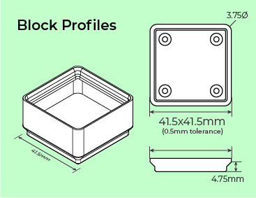

# Unofficial Gridfinity Specification
See [the website](https://gridfinity.xyz/) for more information on the core concept.

## Design Spec

The core of the gridfinity design is the 42x42x7mm grid format. The most basic configuration is two parts, a baseplate and a block.

### The Block
#### Design
Every block fits into the z-shaped socket in a baseplate. The socket allows easy reconfiguration of blocks whilst preventing them becoming dislodged with a vertical lip.

This diagram shows the profiles of a generic empty container block.
It is 41.5mm square to allow some tolerance to fit within the baseplates.

#### Labels
Blocks can optionally have labels for easier organistaion of your containers. They also provide a lip making it easier to pickup individual blocks.

#### Magnets
These can be used to supplement the socket and secure blocks in baseplates more reliably.
The magnets are 6mm diameter, 2mm thickness. Blocks should ideally have holes in all four corners of every unit to ensure compatibility in all rotations.

### The Baseplates
#### Design

